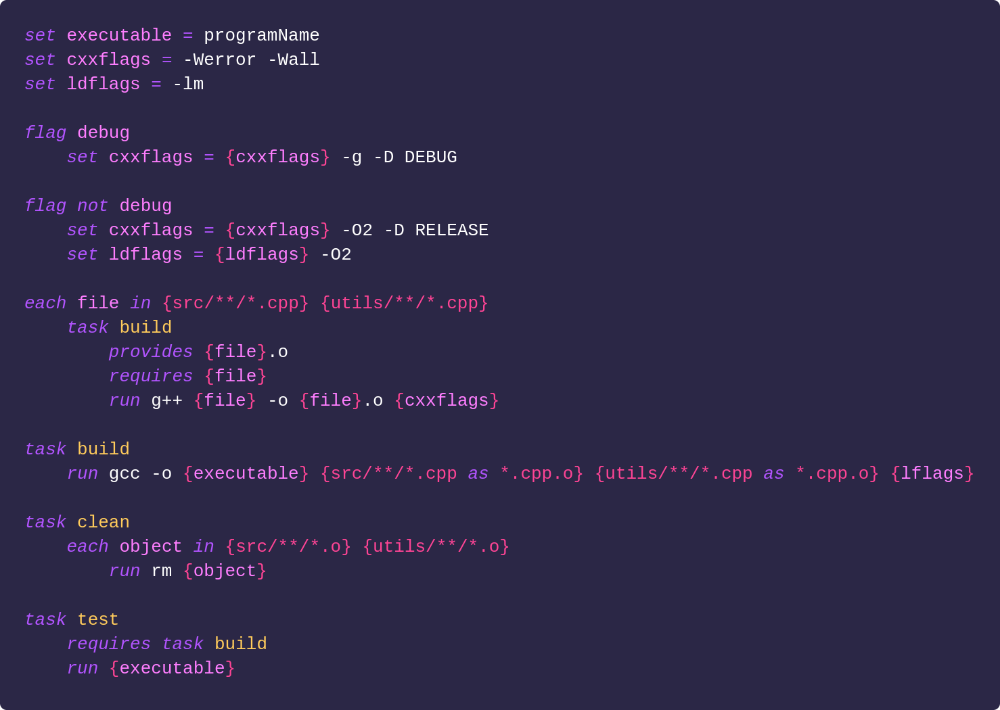

# *Boop!*

<p style="text-align:center"></p>

A dumb, simple build system that happens to not be make.

Boop doesn't try to be clever. Boop is dumb and simple, with a syntax that tries to be straightforward and simple too.

## A basic `tasks.boop` file:



To execute the `build` task with the `debug` flag set:

```
> boop build debug
```

Or to be fancy and keep boop running, watching your files, and *automatically* re-run the `debug` task whenever its files change...

```
> boop build debug --watch
```

## Features

* Easily target files via search globs. You can iterate over them in tasks, *or* specify separate tasks *within* each file iteration, to separate dependencies for each
* Tasks specified as providing files and depending on others only execute when those files are out of date
* Boop is fast, and all tasks are multithreaded based on your cpu core count
* Can be ran in watch mode, automatically watching any dependent files and re-executing the specified task when it becomes out of date
* Watch mode also watches the task file itself, so you can make changes to it while active, and it will auto-reload
* Tasks are executed in a simple predictable order, top to bottom, in parallel, with parent tasks waiting for all their dependencies to complete before proceeeding
* The syntax tries to be simple and clean, so you can think about tasks and files and getting things done, not abstract concepts like dependency chains and job pools
* No hidden gotchas or non-obvious behaviours

## Commandline Parameters

```
Usage: boop [OPTION]... [TASK] [FLAGS]...
Run the TASK in the tasks.boop script, passing it specified FLAGS

  -d, --dry-run          do not actually execute commands (useful with --verbose)
  -h, --help             display this help and exit
  -j [N], --jobs=[N]     set how many tasks may be executed in parallel at once (defaults to 0)
                           N=0 - run no more than the number of cpu cores + 1
                           N=X - run no more than x
  -v [N], --verbose[=N]  set verbosity (defaults to 1)
                           N=0 - print no additional information
                           N=1 - print which tasks are being executed
                           N=2 - ...also print the commands which are being executed
                           N=3 - ...also print debug info about script lines being executed
  -w, --watch            watch all files for changes and restart task whenever they change
      --version          display version information and exit
```

Fuller docs and info is available [here](docs.md).